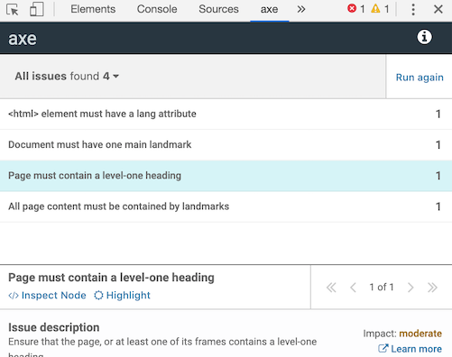
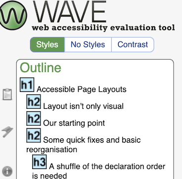
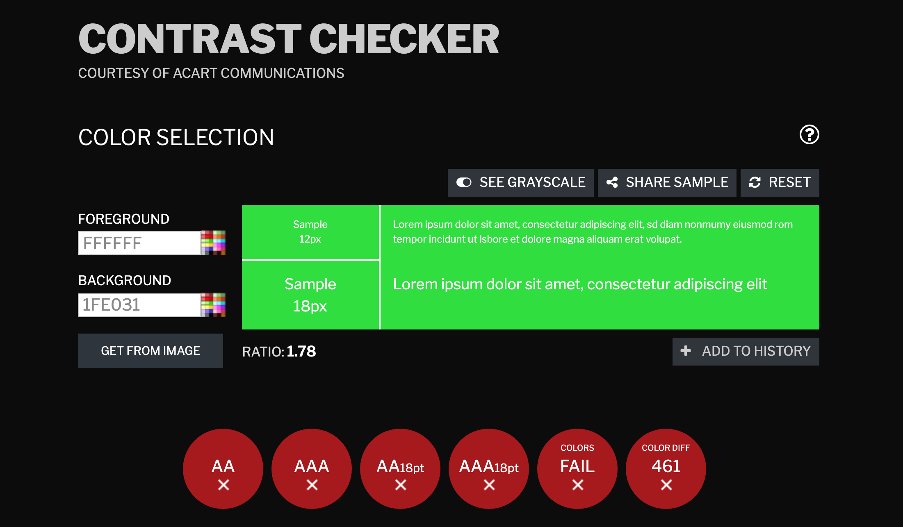
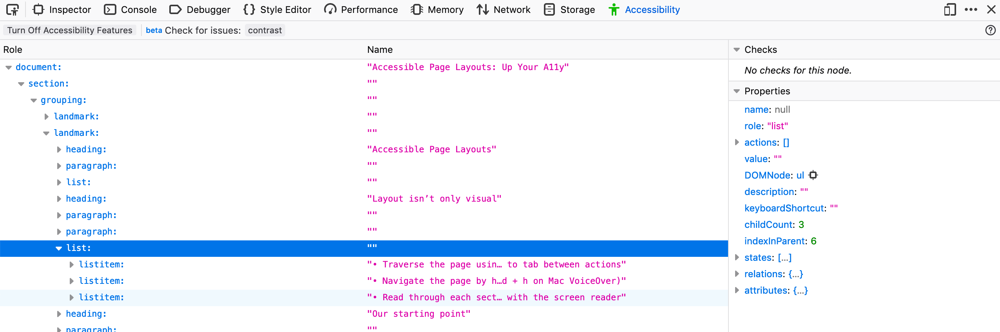

## 5 great tools for accessible development

Writing accessible code can be made so much easier by leveraging some popular tools. This topic covers 5 favourites, plus a few more that you might like to try out. If there’s a great tool you think is missing, please do get in touch! \*\*\* link

### 1. ESLint JSX A11y Plugin

https://www.npmjs.com/package/eslint-plugin-jsx-a11y

Chances are you’re already using ESLint in your JS projects, and adding this plugin to your project/ESLint config is a very quick and effective way to build accessibility into your workflow.

The plugin is great at picking up certain types of errors, e.g. a missing label for a form field, an aria-role value that isn’t valid, and so on. It’s a thorough initial check on your code that will save plenty time in testing down the line. The best part is, if you use a CI tool like Jenkins or Bitbucket Pipelines, you can easily ensure that the lint is run as part of your CI process, making sure that no errors make their way into your production code.

### 2. Axe Chrome Extension

https://chrome.google.com/webstore/detail/axe/lhdoppojpmngadmnindnejefpokejbdd

Axe is an excellent tool to follow on from linting with jsx-a11y. The Axe extension can be used during development in Chrome, and analyses the current page for accessibility issues. It’s great for picking up issues like lack of page landmarks, contrast issues, heading levels increasing inconsistently, and so on.

Happily, it also provides tips on how to fix the issues found, as well as linking out to more detailed explanations and the related WCAG guidelines. The ‘inspect node’ quickly takes you to the offending part of your page for further inspection.

Bear in mind that Axe checks the DOM as it exists at that point in time; if you have multiple states to check, you will need to manipulate them and re-run the tool.

### 3. Wave Chrome Extension

https://chrome.google.com/webstore/detail/wave-evaluation-tool/jbbplnpkjmmeebjpijfedlgcdilocofh

Wave is a similar tool to Axe, developed by WebAIM.org. I’ve included it separately to Axe on this list, as both tools have different strengths, and there’s value in having a quick check of your code in both.

The Wave UI can feel a little noisy compared to Axe, as it directly marks up the page you’re running it on, labelling the headers, alt text for images, interactive elements, navigation and so on. It’s a great way to get a summary of your overall page structure, and the elements that are particularly relevant for users of assistive technologies.

As well as marking up the page, you can view a list breaking down the features of the page, including a useful headers view which allows you to see and get a feel for the tree of your heading levels without having to turn on the screen reader.

Errors are listed with suggestions for fixes, and it also has a nice built-in tool for checking color combination contrast without having to leave the page.

### 4. Contrast Checker

https://contrastchecker.com/

Using Wave or Axe, it’s likely you’ll come across some color contrast issues from time to time, and this Contrast Checker is one of many tools that will check your color combinations against the WCAG 2.0 guidelines.

This tool is particularly recommended, as unlike many other contrast checkers it also allows you to view the colour combination in greyscale, and select your colours from an image which can be handy if you’re quickly checking a design and don’t have the exact hex colours yet.

The output is really nice and clear, outlining how your color combination fares at different font sizes against WCAG AA and AAA.

### 5. Accessibility Support

https://a11ysupport.io/

Accessibility Support is very similar in principle to the much used https://caniuse.com/, only for accessibility specifically. You can search for a particular element or attribute, and get a quick rundown of which assistive technologies are known to support it. It's a great time saver to prevent cross-platform issues, e.g. if a feature is supported in VoiceOver on MacOS but not on NVDA/Windows. The project is community-drive and open-source, so it’s easy to raise an issue or contribute if you can.

### And some extras…

#### Firefox Accessibility Tree Inspector

This facility is available in Chrome also, but Firefox takes the win for most friendly UI. To view a page’s accessibility tree, simply open the developer tools and click on the Accessibility tab. The accessibility tree gives you a nice overview of how assistive technology is going to traverse your page, and the relevant information for each element e.g. what state an element is in or what role it has. There’s a great summary on Mozilla Hacks explaining the uses for accessibility trees. https://hacks.mozilla.org/2019/06/how-accessibility-trees-inform-assistive-tech/

### Color Oracle

https://colororacle.org/

A free color blindness simulator for Mac users, that will allow you to see how users with common types of color blindness will view your site. Not something you will need for day to day development, but certainly interesting to check out, especially given as many as 8 percent of men (and 0.5 percent of women) have some form of color blindness.
